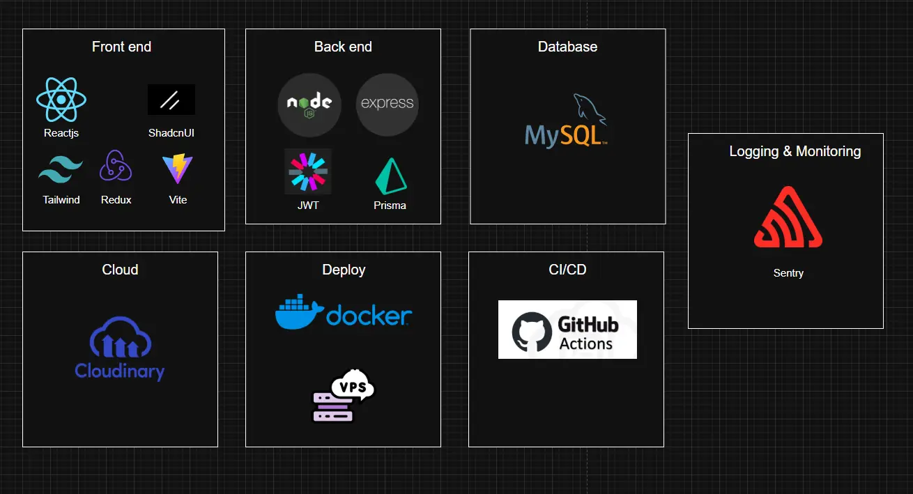

# Ecommerce Frontend

A modern and responsive **Ecommerce Web App** built for scalability, security, and performance.  
This repository contains the **frontend** source code of the project.

---



## Tech Stack

**Frontend**

- ReactJS
- Shadcn UI
- Tailwind CSS
- Redux Toolkit
- Vite

**Backend**

- Node.js / Express
- Prisma ORM
- JWT Authentication
- MySQL Database

  [View Backend Repository](https://github.com/vuutruongnhatthanhhh/tjzenn-ecommerce-nodejs)

**Cloud & Deployment**

- Cloudinary (Media Storage)
- Docker + VPS Deployment
- GitHub Actions (CI/CD)
- Sentry (Logging & Monitoring)

---

## Demo

📺 Watch the full demo on YouTube:  
[Click to Watch Demo](https://www.youtube.com/watch?v=080oQLMAtt0)

---

## Project Overview

For a complete breakdown of features, architecture, and implementation details:  
[Read Full Project Documentation](https://portfolio.tjzenn.com/projects/ecommerce)

Explore more of my work on my portfolio:  
[Visit My Portfolio](https://portfolio.tjzenn.com)

---

## Getting Started

```bash
# 1. Clone the repository
git clone https://github.com/your-username/ecommerce-frontend.git

# 2. Install dependencies
npm install --legacy-peer-deps

# 3. Run development server
npm run dev
```
